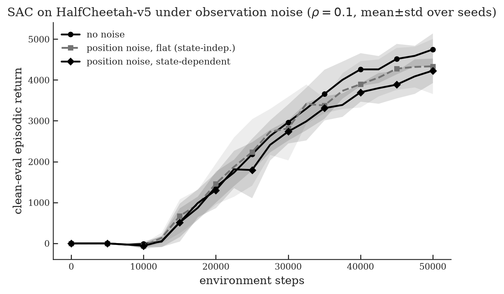
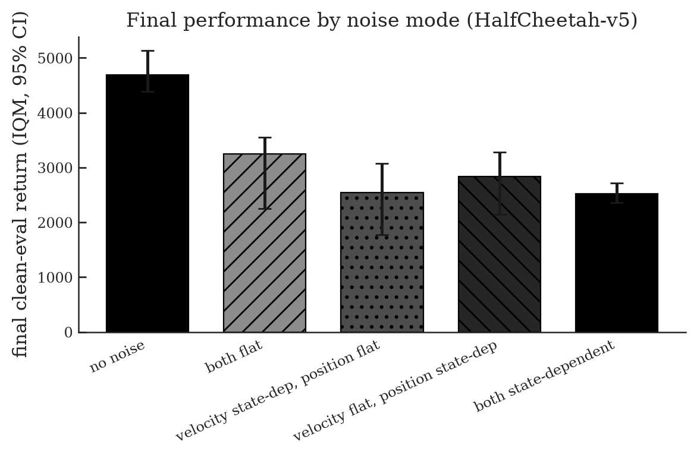

# StochRL

A benchmark for reinforcement learning under realistic sensor noise, built on Soft Actor Critic and MuJoCo.

Most studies that test RL under noise add the same Gaussian jitter to every sensor. Real sensors do not behave that way. Some are noisier than others, some get worse in certain situations, and the errors are not always clean bell curves. StochRL adds noise the way real hardware does. It scales the noise to each sensor, lets it depend on what the robot is doing, and measures how much that changes what SAC learns.

Everything runs on `HalfCheetah-v5`. Training always happens under noise, and every score is measured on a clean, noise free copy of the environment, so we see how much the noise damaged learning rather than how blind the agent is at test time.

## What we found


Three things came out of the experiments.

First, noise really hurts, and the usual way of adding it makes the task look easier than it is. One fixed amount of noise barely touches the fast moving sensors, the ones the controller leans on, so it understates the damage. Scaling the noise to each sensor is fairer and clearly harder.

Second, where the noise lands matters as much as how much you add. The same total noise, aimed at the fast and busy moments, hurts far more than noise spread evenly over time.

Third, the speed sensors are the weak spot. Noise on the joint angle sensors barely dents performance, while the same relative noise on the speed sensors is very damaging.

## All results in one place

Return is shown as a percentage of the no noise score, so higher is better.

| Experiment | Condition | Return vs no noise | Seeds |
|---|---|---|---|
| Noise style | no noise | 100% | 3 |
| | one fixed amount on every sensor | 63% | 3 |
| | scaled to each sensor, 10% of its range | 45% | 3 |
| | realistic mix (drift, dropouts, rounding) | 49% | 3 |
| Velocity timing | steady over time | 72% | 8 |
| | concentrated at fast moments | 54% | 8 |
| Position timing | steady over time | 92% | 8 |
| | concentrated at extreme angles | 89% | 8 |
| Both sensors noisy | both steady | 69% | 8 |
| | velocity timing, position steady | 54% | 8 |
| | velocity steady, position timing | 61% | 8 |
| | both timing | 54% | 8 |
| Noise level, scaled | 5%, 10%, 20% of each sensor | 80%, 45%, 18% | 3 |
| Noise level, realistic | 5%, 10%, 20% of each sensor | 79%, 49%, 29% | 3 |

The sections below add the figures and the confidence intervals.

## How the noise is added

Every sensor gets noise sized to its own normal range. For one sensor at one moment the rule is

```
noise size = rho * (that sensor's normal spread) * (a state factor)
```

`rho` is the single knob, set to 0.1, which means 10 percent. The state factor is where the interesting choices live.

Flat noise keeps the state factor constant, so a sensor gets the same jitter at every step whether the robot is calm or thrashing. Think of a steady background hiss on the sensors.

State dependent noise keeps the total the same but swells the jitter at the extreme moments and shrinks it when things are calm. For a speed sensor that means more noise when moving fast. For a joint angle it means more noise at large deflections.

Sensors can also get richer patterns. Positions get a little Gaussian noise plus rounding, like a real encoder. Velocities get slow drift plus the occasional dropped reading. The figures show the clean and noisy signals side by side, and how the state dependent noise grows with speed.


Sizing per sensor matters because the sensors are on very different scales. On HalfCheetah they span about forty times, from slow joint angles to fast joint velocities.


A single fixed amount is huge for the small sensors and invisible for the large ones, which is why the naive approach quietly under tests the channels that count.

## The experiments in detail

### Noise style


Adding noise drops SAC to somewhere between 45 and 63 percent of its clean score, and the clean run is still improving at the end while the noisy ones have flattened. The fixed amount version looks least harmful only because it barely perturbs the fast sensors. Once the noise is scaled to each sensor it bites harder.

### Where the noise lands

Each pair below carries the same total noise and differs only in timing. These runs use 8 seeds.

Velocity sensors, and the effect is real.


| Velocity noise | IQM score | 95% interval | vs no noise |
|---|---|---|---|
| steady | 3355 | 2895 to 3671 | 72% |
| concentrated at fast moments | 2523 | 2215 to 2724 | 54% |

Bunching the noise at the fast moments costs about 18 points, and the intervals do not overlap, so this is a genuine effect rather than luck.

Position sensors, and it barely matters.



| Position noise | IQM score | 95% interval | vs no noise |
|---|---|---|---|
| steady | 4329 | 3885 to 4812 | 92% |
| concentrated at extreme angles | 4184 | 3989 to 4499 | 89% |

Position noise hardly dents performance and the two settings overlap. Speed sensing is the vulnerability, joint angle sensing is robust.

Both sensor groups noisy at once.



| Both sensors noisy | IQM score | vs no noise |
|---|---|---|
| both steady | 3252 | 69% |
| velocity timing, position steady | 2542 | 54% |
| velocity steady, position timing | 2842 | 61% |
| both timing | 2522 | 54% |

The velocity timing does the damage. Adding timing to velocity drops the score from 69 to 54 percent, adding it to position only reaches 61, and doing both is no worse than velocity alone. The two do not pile on top of each other. The message is consistent everywhere. State dependence matters where the sensor matters, and that is velocity.

### How damage scales with the noise level


| Noise level | scaled noise | realistic noise |
|---|---|---|
| 5% | 80% | 79% |
| 10% | 45% | 49% |
| 20% | 18% | 29% |

Damage climbs fast. At 20 percent SAC drops below a third of its clean score. The two styles look the same at low levels, but the realistic drift noise becomes a little less harmful as the level rises, probably because slow drift is more predictable than fresh random jitter. The spread across seeds is wide at 20 percent, so treat that gap as a trend for now.

## Parameters and constants

Everything the experiments and code depend on, in one place.

| Setting | Value |
|---|---|
| Environment | HalfCheetah-v5, Gymnasium MuJoCo |
| Algorithm | Soft Actor Critic, CleanRL single file, run unchanged |
| Replay buffer | stable-baselines3 buffer, size 1,000,000 |
| Network | two hidden layers of 256 units, ReLU, twin critics, tanh Gaussian policy |
| Discount gamma | 0.99 |
| Target smoothing tau | 0.005 |
| Batch size | 256 |
| Learning starts after | 5,000 steps |
| Policy learning rate | 3e-4 |
| Critic learning rate | 1e-3 |
| Update schedule | policy every 2 steps, target networks every step |
| Entropy temperature | tuned automatically, target entropy equal to minus the action dimension |
| Log std range | negative 5 to positive 2 |
| Training length | 50,000 steps per run, a short prototype budget (real studies use 1,000,000) |
| Noise level rho | 0.1 by default, also 0.05 and 0.2 for the level sweep |
| Calibration | each sensor's scale measured from a 10,000 step random rollout, fixed seed 0, shared by all runs |
| State factor, state dependent | 0.5 plus the distance from typical, in units of the sensor's own spread |
| State factor, flat | a constant equal to the root mean square of the above, about 1.43, so both inject equal total noise |
| Position channels used | joint angle sensors only, the first two (torso height and pitch) are left clean because they drift between runs |
| Evaluation | 3 episodes on a clean environment every 2,500 steps, using the greedy mean action |
| Seeds | 3 for the noise style and level studies, 8 for the state dependence study |
| Aggregation | interquartile mean across seeds with a 95 percent bootstrap interval, falls back to the plain mean below 4 seeds |
| Compute | CPU, 1 thread per run, 12 runs in parallel, which is fastest for these small networks |

## How it was kept honest

The SAC and noise code went through an adversarial review by several independent agents that tried to break it. That caught and fixed five real bugs, among them a miscalibrated drift process and a calibration seed that varied between runs. Swapping in the exact CleanRL SAC reproduced our numbers to the digit, which confirms the baseline is faithful. Full notes live in AUDIT.md.

A few honest limits. This is one environment at a short 50,000 step budget. The noise style and level studies use 3 seeds and are reported as plain means. The state dependence study uses 8 seeds with proper interquartile means and intervals. The stochastic transition variant, where the world itself is jolted rather than the readings, and a comparison across learning algorithms, are both still to do.

## Reproduce it

```bash
uv sync

# draw the noise pattern figures into assets
uv run python scripts/explore_noise.py --env HalfCheetah-v5 --outdir assets

# noise style study, then aggregate
uv run python scripts/run_benchmark.py --modes none uniform uniform-calibrated realistic \
    --seeds 1 2 3 --total-timesteps 50000 --jobs 12 --threads-per-job 1 --outdir results_modes
uv run python scripts/plot_results.py --outdir results_modes --figdir assets --prefix benchmark

# state dependence study at 8 seeds, velocity and position and both
uv run python scripts/run_benchmark.py \
    --modes none vel-flat vel-statedep pos-flat pos-statedep both-ff both-sf both-fs both-ss \
    --seeds 1 2 3 4 5 6 7 8 --total-timesteps 50000 --jobs 12 --threads-per-job 1 --outdir results_sd8
uv run python scripts/plot_results.py --outdir results_sd8 --figdir assets --prefix statedep --modes none vel-flat vel-statedep

# noise level sweep
uv run python scripts/run_benchmark.py --modes uniform-calibrated realistic --seeds 1 2 3 \
    --rho 0.05 --outdir results_rho005 --total-timesteps 50000 --jobs 12 --threads-per-job 1
```

## Repo layout

```
src/stochrl/
  noise.py       the noise processes and the model that applies them
  calibrate.py   measures each sensor's normal spread
  presets.py     ready made noise setups (uniform, realistic, isolation, combined)
  wrappers.py    gymnasium wrappers that add observation or action noise
  plotting.py    shared black and white figure style
  stats.py       interquartile mean and bootstrap intervals
scripts/
  explore_noise.py           draw the noise pattern figures
  sac_continuous_action.py   the CleanRL SAC with noise switched in
  run_benchmark.py           run many seeds and modes in parallel
  plot_results.py            turn results into figures and tables
  plot_rho.py                the noise level figure
```
