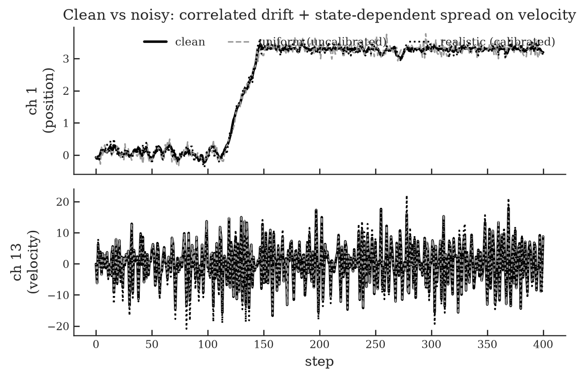
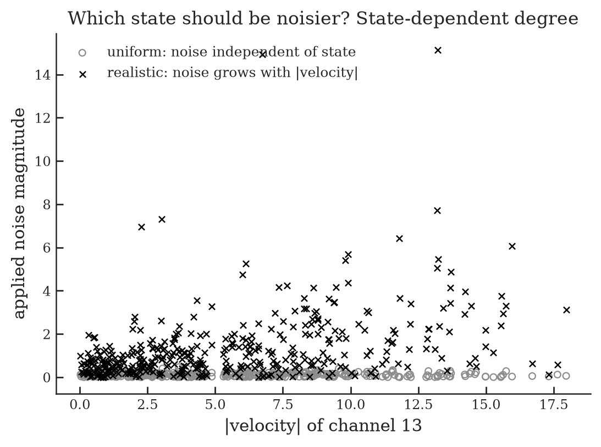
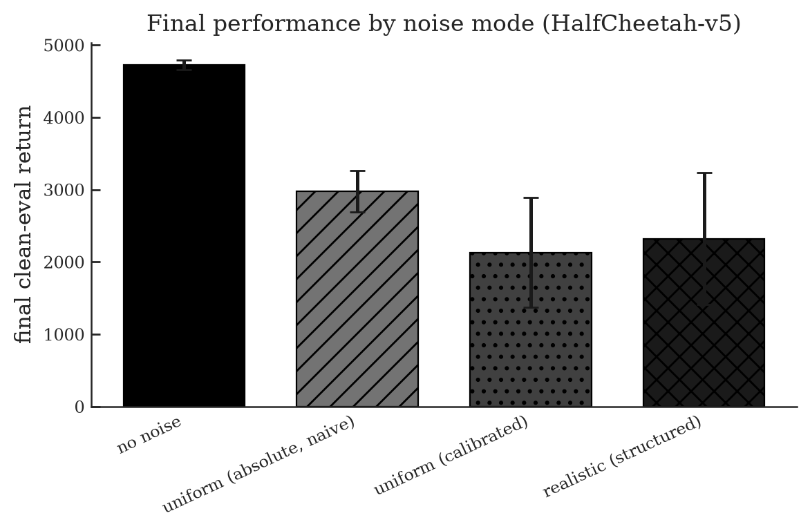

# StochRL

**A signal-calibrated, per-channel noise benchmark for continuous-control RL.**

Most studies of RL under noise (including the paper this builds on) add a *single
uniform Gaussian* to every observation dimension. That is unrealistic, and it
biases robustness results. This project replaces it with noise that is calibrated
per channel, can depend on the state, and supports realistic non-Gaussian failure
modes — and measures what difference that makes for Soft Actor-Critic (SAC).

---

## TL;DR

Under matched-`rho` observation noise on `HalfCheetah-v5`, SAC's final performance:


| Noise mode | Final clean-eval return | vs. clean |
|---|---:|---:|
| `none` | **4726 ± 68** | 100% |
| `uniform` (absolute σ — *the common protocol*) | 2977 ± 287 | 63% |
| `uniform-calibrated` (per-channel σ) | 2130 ± 758 | 45% |
| `realistic` (structured, state-dependent) | 2319 ± 911 | 49% |

**Headline:** the common "one absolute σ everywhere" protocol *under-perturbs the
channels that matter* and so **understates how hard noise really is**. Calibrating
the noise to each channel's scale is both more honest and measurably harder.

---

## 1. Why uniform Gaussian noise is the wrong default

A continuous-control observation packs together quantities on wildly different
scales. On `HalfCheetah-v5` the 17 channels span a **~40× range** in magnitude
(slow-moving joint angles vs. fast joint velocities):


Adding one absolute `σ` to all of them is like adding "±5 cm" of error to both a
millimetre ruler and a kilometre tape — catastrophic for one, invisible for the
other. Concretely, `σ = 0.1` is ~50% of a position channel's natural variation but
only ~1.4% of a velocity channel's. So the naive protocol barely touches the
high-signal channels — the very ones the controller relies on.

---

## 2. The framework: which channel · which pattern · what degree

A `NoiseModel` answers three questions, each an explicit, swappable choice:

| Question | Mechanism (`src/stochrl/`) |
|---|---|
| **WHICH** channel/state? | per-channel assignment `ChannelNoise(indices, process, gain_fn)` |
| **WHICH PATTERN?** | a `NoiseProcess`: `Gaussian`, `OrnsteinUhlenbeck` (drift), `MultiplicativeGaussian`, `Dropout`, `Quantization`, `Bias`, `Saturation`, `Delay`, `Compose` |
| **WHAT DEGREE?** | **calibrate to each channel's own signal std** (`calibrate.py`), so one knob `rho` = "fraction of this channel's natural variation" — comparable across channels and environments. An optional `gain_fn(state)` makes the degree state-dependent. |

The `realistic` preset gives positions and velocities physically distinct noise —
positions get a little Gaussian + encoder quantization; velocities get temporally
correlated **drift** + occasional **dropout**, scaled up when moving fast:



And the state-dependent degree — velocity noise that grows with `|velocity|`, vs.
flat uniform noise:



---

## 3. Methodology (so the benchmark is trustworthy, not just plausible)

- **Clean evaluation.** Training happens under noise, but every reported number is
  a deterministic eval on a *noise-free* env — this separates "noise disrupted
  learning" from "noise made the task harder to execute".
- **Matched energy.** Modes share seeds and a single fixed calibration, and noise
  levels are per-channel-calibrated, so comparisons isolate the *structure* of the
  noise, not its total amount.
- **Reproducibility.** Independent RNG streams for env / policy / obs-noise /
  action-noise; identical seeds produce byte-identical runs.
- **Audited.** Before trusting any number, the SAC + noise code went through an
  adversarial multi-agent correctness audit (5 independent reviewers + skeptical
  verifiers). It found and fixed **5 real bugs**, including a mis-calibrated drift
  process and a calibration-seed confound that would have invalidated the
  comparison. See `AUDIT.md`.
- **CleanRL baseline.** SAC is CleanRL's `sac_continuous_action.py` — networks,
  update, and hyperparameters verbatim — on the stable-baselines3 replay buffer.
  Swapping the literal CleanRL code in reproduced earlier results bit-for-bit,
  confirming the baseline was a faithful reproduction.

---

## 4. Results

### 4a. Noise modes compared



1. **Observation noise during training substantially impairs SAC** — every mode
   reaches only 45–63% of clean, and clean is still climbing at 50k while the noisy
   runs plateau.
2. **Naive absolute-σ noise under-perturbs the important channels** (exact,
   mechanical: σ=0.1 ≈ 1.4% of velocity scale vs ~50% of position scale). Calibrated
   noise applies an honest 10% everywhere and is more damaging on average (45% vs
   63%). *The learning-outcome direction holds for 2/3 seeds; the under-perturbation
   mechanism is exact regardless.*
3. **At matched energy, structure ≈ calibrated magnitude — so far.** `realistic`
   (49%) and `uniform-calibrated` (45%) overlap within seed variance, raising the
   question §4b answers directly.

### 4b. Does *where* the noise lands matter? (state-dependence, isolated)

To test state-dependence on its own, two settings put the **same total noise** on
the velocity channels, differing only in placement: `vel-flat` spreads it evenly;
`vel-statedep` concentrates it at high speed (matched average variance, verified
within 2%).


| Setting | Final clean-eval return | vs. clean |
|---|---:|---:|
| `none` | 4726 ± 68 | 100% |
| `vel-flat` (noise spread evenly) | 3269 ± 327 | 69% |
| `vel-statedep` (noise concentrated at high speed) | 2489 ± 112 | 53% |

**Yes — placement matters, decisively.** With the *same total noise*, concentrating
it on the high-speed (dynamically critical) states costs SAC ~16 points more than
spreading it evenly (53% vs 69% of clean). Unlike the §4a rankings, this gap is
robust: the std bands don't overlap, and `vel-statedep` is remarkably consistent
across seeds (±112). So **state-dependence is a real, separable effect that
per-channel calibration alone does not capture** — it earns its place as a benchmark
axis. (This is the direct answer to "should noise depend on the state?": for *where*
it hurts most, yes.)

### 4c. How damage scales with noise level

Dose-response (paper-style): final return vs `rho` for the two calibrated
observation-noise models, anchored at `rho=0` (no noise).


| `rho` | uniform-calibrated | realistic |
|---|---:|---:|
| 0.05 | 80% | 79% |
| 0.10 | 45% | 49% |
| 0.20 | 18% | 29% |

Damage is **steep and monotonic** — at `rho=0.2` SAC collapses to under 30% of clean.
The two models are indistinguishable at low noise, but the **structured (`realistic`)
model becomes relatively *less* harmful as noise grows** (29% vs 18% at `rho=0.2`):
its temporally-correlated drift is more predictable than fresh white noise of the
same calibrated magnitude. (Seed variance is large at `rho=0.2`, so the high-noise
gap is a trend, not yet significant.)

---

## 5. Reproduce it

```bash
uv sync

# visualise the noise patterns (the figures above) -> assets/
uv run python scripts/explore_noise.py --env HalfCheetah-v5 --outdir assets

# run a benchmark sweep (modes x seeds), then aggregate
uv run python scripts/run_benchmark.py --modes none uniform uniform-calibrated realistic \
    --seeds 1 2 3 --total-timesteps 50000 --jobs 4
uv run python scripts/plot_results.py --outdir results --figdir assets --prefix benchmark

# the state-dependence isolation experiment
uv run python scripts/run_benchmark.py --modes none vel-flat vel-statedep \
    --seeds 1 2 3 --total-timesteps 50000 --jobs 4 --outdir results_statedep
uv run python scripts/plot_results.py --outdir results_statedep --figdir assets --prefix statedep

# noise-level (rho) dose-response
uv run python scripts/run_benchmark.py --modes uniform-calibrated realistic --seeds 1 2 3 \
    --rho 0.05 --outdir results_rho005 --total-timesteps 50000 --jobs 4
uv run python scripts/run_benchmark.py --modes uniform-calibrated realistic --seeds 1 2 3 \
    --rho 0.2 --outdir results_rho020 --total-timesteps 50000 --jobs 4
uv run python scripts/plot_rho.py --pairs 0.05:results_rho005 0.1:results_cleanrl 0.2:results_rho020
```
