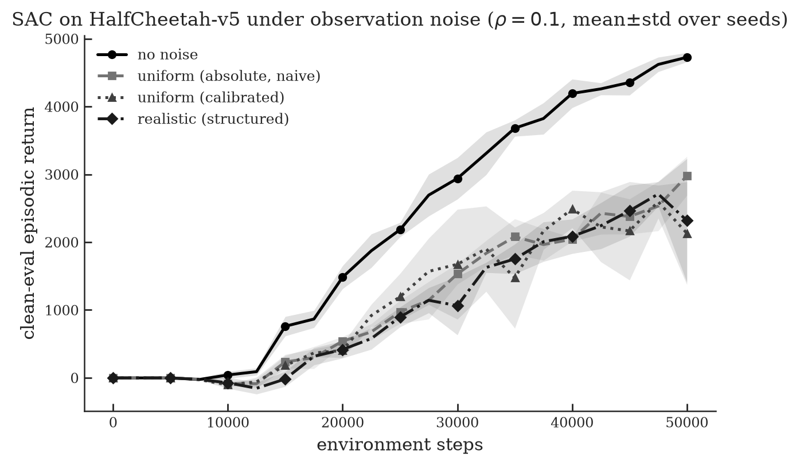
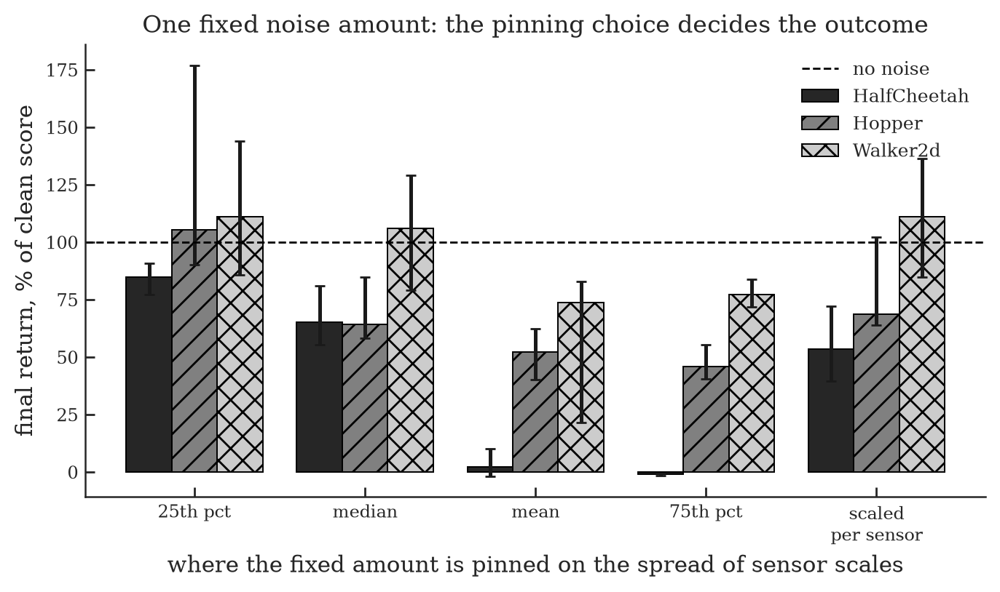
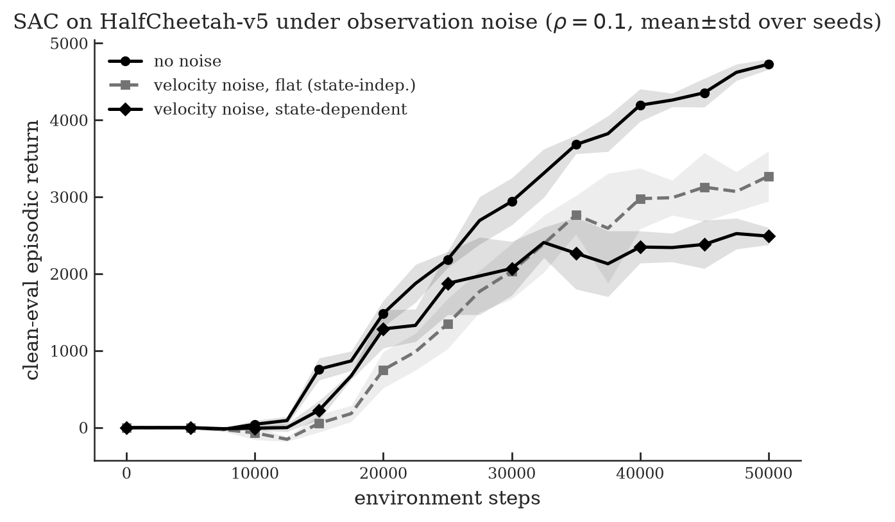
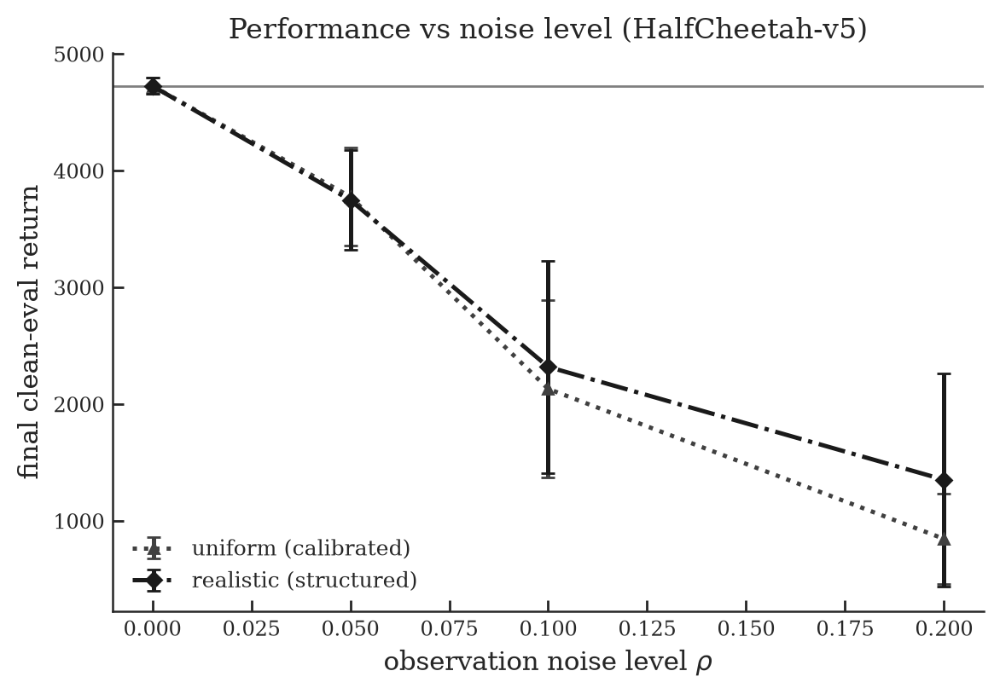
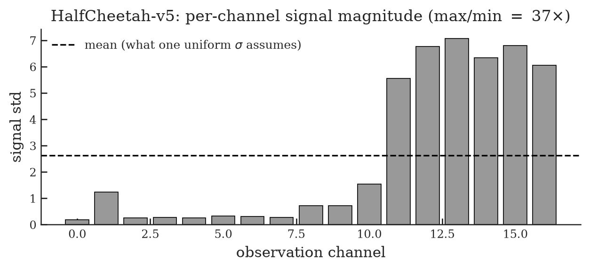

# StochRL

A benchmark for reinforcement learning under realistic sensor noise, built on Soft Actor Critic and MuJoCo (Gymnasium `HalfCheetah-v5`, `Hopper-v5`, `Walker2d-v5`). Most noise studies add the same Gaussian jitter to every sensor; real sensors differ in scale, degrade in certain situations, and fail in non-Gaussian ways. StochRL sizes noise per sensor and lets it depend on the state. Training always happens under noise, and every score is the return on a clean copy of the environment, so the numbers measure damage to learning.

## Results

Every cell is the final return as a percentage of that study's no noise score; higher is better.

| Experiment | Environment | % of no noise score | Seeds |
|---|---|---|---|
| Noise style: absolute / scaled / realistic | HalfCheetah | 63 / 45 / 49 | 3 |
| | Hopper | 42 / 78 / 27 | 5 |
| | Walker2d | 93 / 104 / 108 | 5 |
| Fixed pinning: p25 / median / mean / p75 / scaled | HalfCheetah | 85 / 65 / 2 / -1 / 53 | 8 |
| | Hopper | 105 / 64 / 52 / 46 / 69 | 8 |
| | Walker2d | 111 / 106 / 74 / 77 / 111 | 8 |
| Velocity timing: steady / at fast moments | HalfCheetah | 72 / 54 | 8 |
| Position timing: steady / at extremes | HalfCheetah | 92 / 89 | 8 |
| Both groups: steady / vel timed / pos timed / both timed | HalfCheetah | 69 / 54 / 61 / 54 | 8 |
| Noise level 0.05 / 0.1 / 0.2, scaled | HalfCheetah | 80 / 45 / 18 | 3 |
| Noise level 0.05 / 0.1 / 0.2, realistic | HalfCheetah | 79 / 49 / 29 | 3 |

The fixed pinning rows are the main point: depending on where the one number sits on the sensor-scale spread, the same benchmark calls the noise harmless (85% of clean) or fatal (2%), on all three robots, while the scaled version needs no such choice. The absolute baseline also flips sides between robots, mildest on HalfCheetah and harshest on Hopper, because the same sigma is relatively larger on Hopper's smaller sensors. Velocity sensors are the weak point: with total variance matched, moving their noise to the fast moments costs 72 against 54 percent of clean, and the identical manipulation on position sensors does nothing. Walker2d learns too little at this budget to separate conditions.

Learning curves by noise style:



Fixed amount by pinning choice:



Velocity noise, steady against timed:



Return against noise level:



## Conditions

| Condition | Meaning |
|---|---|
| absolute | the standard baseline: the same sigma = rho on every channel |
| scaled | sigma proportional to each sensor's own spread |
| fixed pinning | the baseline's one number pinned at the p25 / median / mean / p75 of the channel-scale spread |
| realistic | quantised positions; drifting velocities with dropouts, noisier at speed |
| timing | the same total noise on the velocity or position channels, spread evenly (steady) or concentrated at fast or extreme moments (timed); variance matched |

The rule for one sensor at one moment:

```
noise size = rho * (that sensor's normal spread) * (a state factor)
```

The spread is measured once from a 10,000 step random rollout with a fixed seed shared by every run; `rho` is 0.1 by default. Per-sensor sizing matters because the scales span 37x (HalfCheetah), 72x (Hopper) and 112x (Walker2d) between the smallest and largest channels.



## Setup

| Setting | Value |
|---|---|
| Algorithm | SAC, CleanRL single file, unchanged (reproduction checked to the digit) |
| Replay buffer | stable-baselines3, size 1e6 |
| Network | 2 x 256 ReLU, twin critics, tanh Gaussian policy, log std in [-5, 2] |
| gamma / tau / batch | 0.99 / 0.005 / 256 |
| Learning rates | policy 3e-4, critics 1e-3 |
| Update schedule | critics every step, policy every 2, targets every step |
| Entropy temperature | auto-tuned, target entropy = -(action dim) |
| Training length | 50,000 steps per run (short prototype budget); learning starts at 5,000 |
| Noise level rho | 0.1 default; 0.05 and 0.2 in the level sweep |
| Calibration | per-sensor spread from a 10,000 step random rollout, fixed seed 0, shared by all runs |
| State factor | statedep: 0.5 + distance from typical, in units of the sensor's spread; flat: constant = RMS of that, so total noise matches |
| Position channels | joint angles only; root pose channels left clean (non-stationary) |
| Random streams | obs noise, action noise, calibration, env and policy seeded independently; same seed, byte-identical run |
| Evaluation | 3 clean-env episodes every 2,500 steps, greedy mean action |
| Seeds | 3 (noise style, level), 8 (state dependence, fixed pinning), 5 (Hopper/Walker2d style check) |
| Aggregation | IQM with 95% bootstrap CI; plain mean below 4 seeds |
| Compute | CPU, 1 thread per run, 12 in parallel |

The budget is a short 50,000 steps everywhere, the 3-seed studies are plain means, and Walker2d barely learns at this budget, so its numbers say little.

## Reproduce

```bash
uv sync

# noise pattern figures
uv run python scripts/explore_noise.py --env HalfCheetah-v5 --outdir assets

# noise style study
uv run python scripts/run_benchmark.py --modes none uniform uniform-calibrated realistic \
    --seeds 1 2 3 --total-timesteps 50000 --jobs 12 --threads-per-job 1 --outdir results_modes
uv run python scripts/plot_results.py --outdir results_modes --figdir assets --prefix benchmark

# fixed amount by pinning point, on all three environments
uv run python scripts/run_benchmark.py \
    --modes none fixed-p25 fixed-median fixed-mean fixed-p75 uniform-calibrated \
    --seeds 1 2 3 4 5 6 7 8 --total-timesteps 50000 --jobs 12 --threads-per-job 1 --outdir results_fixed
uv run python scripts/run_benchmark.py --env-id Hopper-v5 \
    --modes none fixed-p25 fixed-median fixed-mean fixed-p75 uniform-calibrated \
    --seeds 1 2 3 4 5 6 7 8 --total-timesteps 50000 --jobs 12 --threads-per-job 1 --outdir results_fixed_hopper
uv run python scripts/run_benchmark.py --env-id Walker2d-v5 \
    --modes none fixed-p25 fixed-median fixed-mean fixed-p75 uniform-calibrated \
    --seeds 1 2 3 4 5 6 7 8 --total-timesteps 50000 --jobs 12 --threads-per-job 1 --outdir results_fixed_walker2d
uv run python scripts/plot_fixed.py --figdir assets --pairs HalfCheetah-v5:results_fixed \
    Hopper-v5:results_fixed_hopper Walker2d-v5:results_fixed_walker2d

# state dependence study, velocity and position and both
uv run python scripts/run_benchmark.py \
    --modes none vel-flat vel-statedep pos-flat pos-statedep both-ff both-sf both-fs both-ss \
    --seeds 1 2 3 4 5 6 7 8 --total-timesteps 50000 --jobs 12 --threads-per-job 1 --outdir results_sd8
uv run python scripts/plot_results.py --outdir results_sd8 --figdir assets --prefix statedep --modes none vel-flat vel-statedep

# noise level sweep
uv run python scripts/run_benchmark.py --modes uniform-calibrated realistic --seeds 1 2 3 \
    --rho 0.05 --outdir results_rho005 --total-timesteps 50000 --jobs 12 --threads-per-job 1
uv run python scripts/run_benchmark.py --modes uniform-calibrated realistic --seeds 1 2 3 \
    --rho 0.2 --outdir results_rho020 --total-timesteps 50000 --jobs 12 --threads-per-job 1
uv run python scripts/plot_rho.py --pairs 0.05:results_rho005 0.1:results_modes 0.2:results_rho020 \
    --clean-dir results_modes

# other environments, noise style (repeat with Walker2d-v5 / results_walker2d / --prefix walker2d)
uv run python scripts/run_benchmark.py --env-id Hopper-v5 --modes none uniform uniform-calibrated realistic \
    --seeds 1 2 3 4 5 --total-timesteps 50000 --jobs 12 --threads-per-job 1 --outdir results_hopper
uv run python scripts/plot_results.py --outdir results_hopper --figdir assets --prefix hopper
```

## Repo layout

```
src/stochrl/
  noise.py       the noise processes and the model that applies them
  calibrate.py   measures each sensor's normal spread
  envs.py        env construction, flattens dict observations
  presets.py     ready made noise setups (uniform, fixed, realistic, isolation, combined)
  wrappers.py    gymnasium wrappers that add observation or action noise
  plotting.py    shared black and white figure style
  stats.py       interquartile mean and bootstrap intervals
scripts/
  explore_noise.py           draw the noise pattern figures
  sac_continuous_action.py   the CleanRL SAC with noise switched in
  run_benchmark.py           run many seeds and modes in parallel
  plot_results.py            turn results into figures and tables
  plot_fixed.py              the fixed-amount pinning figures
  plot_rho.py                the noise level figure
```
